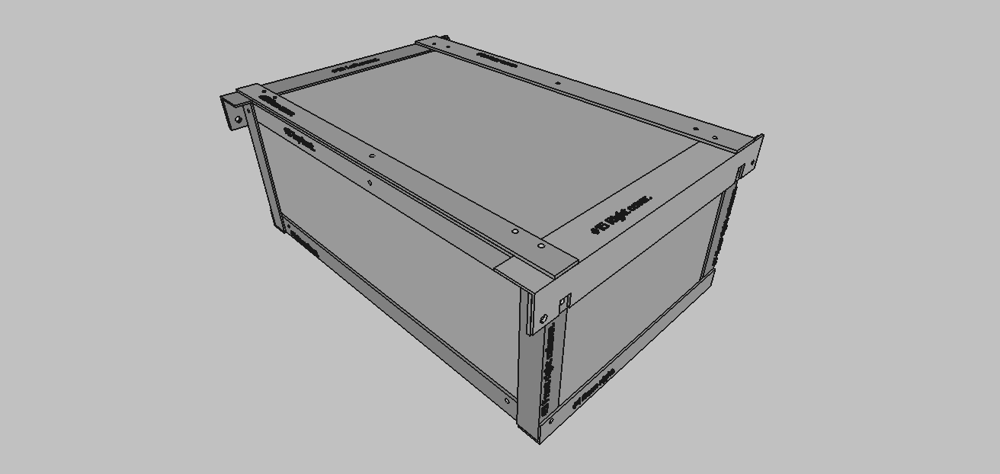
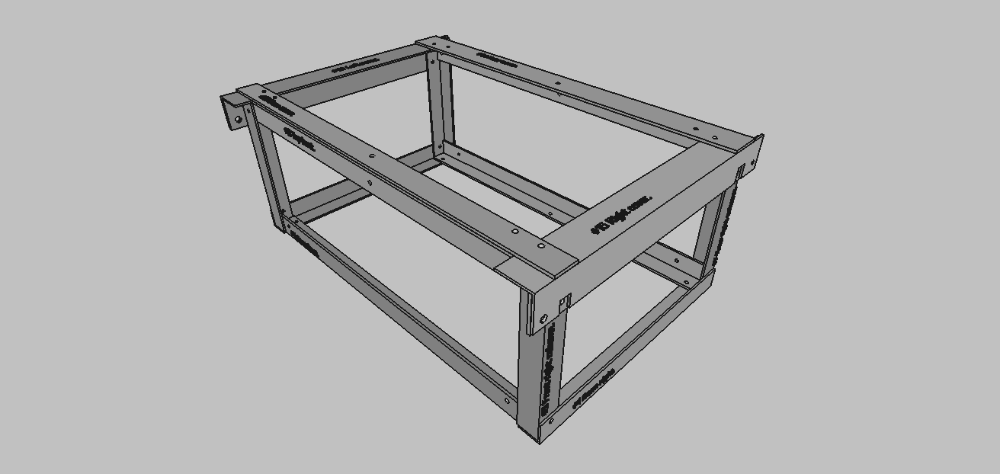

```console
   ____             __             
  / __/_ _____ ___ / /___ _____ _/|
 _\ \/ // (_-</ -_) __/ // / _ > _<
/___/\_, /___/\__/\__/\_,_/ .__//  
    /___/                /_/       
> Systems development company.
```

- [Boxes.](#boxes)

# Boxes.

1. Boxes may be stacked with each other and join the internal space between them.
2. **Each box** shall have on its exterior a part that allows it to be assembled on any of its sides with another box of the same size or of other sizes, all the boxes shall have harmonious measurements so that they can be assembled together to form figures between them, they shall therefore have a part that allows them to be assembled with another box and can be secured in such a way that only with a key or by opening a padlock can they be disassembled.
3. **Each box** shall have perforations that allow it to be assembled on the floor, on a wall or on the ceiling. On the floor, walls or ceiling there shall be a part assembled with deep holes in the concrete that will allow the drawer(s) to be assembled and secured with padlocks, so that they cannot be moved by anyone but the owner of the padlocks.
4. **Each box** shall be capable of being locked with a key, key or padlock, so that it cannot be opened by anyone but the owner.
5. Aluminium material or (similar in weight, more economical and equal or superior in strength to aluminium).

----





----

1. [Box: 180 x 290 x 470 mm.](./18x29x47cms/180x290x470mm.md)
2. [Box: 290 x 290 x 470 mm.](./29x29x47cms/290x290x470mm.md)
3. [Box: 290 x 470 x 470 mm.](./29x47x47cms/290x470x470mm.md)
4. [Box: 290 x 470 x 760 mm.](./29x47x76cms/290x470x760mm.md)

----